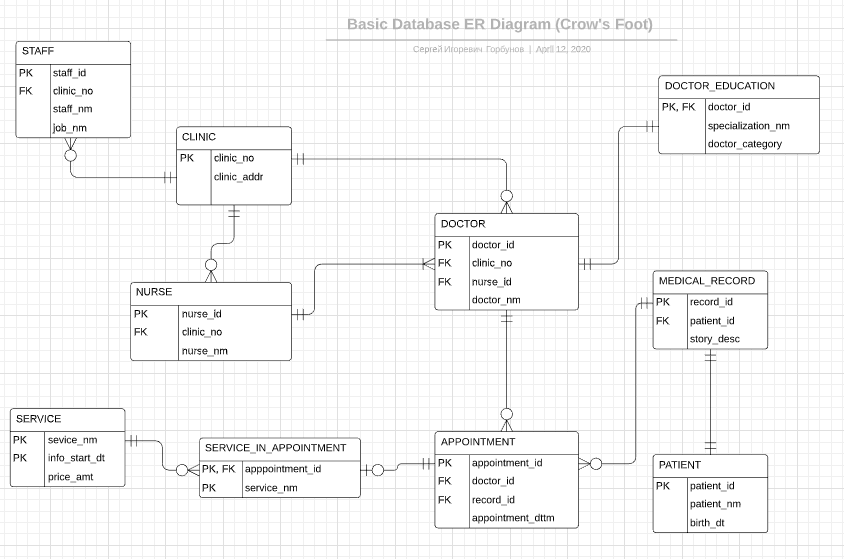

# Семестровая работа по курсу "Базы данных"

## Этап проектирования

### Предметная область

В качестве объекта для изучения была выбрана абстрактная сеть частных стоматологических клиник. Будем считать, что её владелец решил цифровизовать свой бизнес, чтобы удобно учитывать все оказанные услуги, хранить историю болезни пациентов, а также выявлять неэффективных работников.

### Концептуальная модель

Проектирование начинается с создания концептуальной модели. На этом этапе выделяются ключевые сущности, связи между ними обозначаются с помощью нотации "воронья лапка":

### Логическая модель

Следующий шаг - создание логической модели. Она получается из концептуальной путём добавления к сущностям атрибутов. В процессе появляются новые сущности во избежание связей "многие ко многим":

Более подробное описание сущностей и их атрибутов можно найти в [документе](./docs/descriptions.pdf).

### Физическая модель

Проектирование завершается созданием физической модели, для этого используется СУБД `PostgreSQL`. По сути мы переносим уже готовую логическую модель в такой вид, что её будем понимать и мы (надеюсь), и компьютер.

Инструкции в языке `SQL` делятся на несколько типов. Прежде всего потребуется `Data Definition Language`: помощью `CREATE`-запросов мы описываем отношения, которые присутствуют в базе данных. Понаблюдать за этим можно [здесь](./scripts/initialization.sql).

Далее воспользуемся `Data Manipulation Language`. На этом шаге с помощью `INSERT`-запросов описанные выше таблицы заполняются данными, чтобы в дальнейшем с ними можно было работать. Все инструкции можно найти в [файле](./scripts/insertion.sql).

## Дополнительно

### Версионность

Таблица `SERVICE` является версионной, поскольку стоимость различных услуг с течением времени может меняться (инфляция, смена поставщика расходных материалов и так далее). В свою очередь, для каждого приёма мы храним только его время и список услуг, поэтому нам важно знать, сколько стоила та или иная услуга в определённый момент времени. Версионность достигается путём использования `SCD` типа 2: имеется информация и момент времени, начиная с которого она является актуальной. Актуальность сохраняется до следующего момента времени, а если его нет, то она актуальна и в данный момент.
